# 🏊‍♂️ Player Management System - Swim Lane Diagram

## System Overview

This diagram shows the complete flow of the Player and Scorecard management system, including user interactions, API endpoints, database operations, and data flow.

```mermaid
sequenceDiagram
    participant U as User/Browser
    participant W as Web Interface
    participant A as Flask API
    participant M as Models
    participant D as Database
    participant S as SQLite

    Note over U,S: 🏀 PLAYER MANAGEMENT SYSTEM SWIM LANE DIAGRAM

    %% User Interface Flow
    rect rgb(240, 248, 255)
        Note over U,W: 🌐 WEB INTERFACE FLOW
        U->>W: Navigate to /players
        W->>A: GET /api/stats
        A->>D: get_database_stats()
        D->>S: SELECT COUNT(*) FROM players, scorecards
        S-->>D: Return counts
        D-->>A: Return stats object
        A-->>W: JSON response with stats
        W->>A: GET /api/players
        A->>D: get_all_players()
        D->>S: SELECT * FROM players ORDER BY name
        S-->>D: Return player rows
        D->>D: _load_player_scorecards() for each player
        D->>S: SELECT * FROM scorecards WHERE player_name = ?
        S-->>D: Return scorecard rows
        D-->>A: Return Player objects with scorecards
        A-->>W: JSON response with players
        W-->>U: Display player cards and stats
    end

    %% Create Player Flow
    rect rgb(255, 248, 240)
        Note over U,S: ➕ CREATE PLAYER FLOW
        U->>W: Fill player name form
        U->>W: Click "Create Player"
        W->>A: POST /api/players
        Note right of A: {"name": "LeBron James"}
        A->>A: Validate input data
        A->>D: get_player_by_name("LeBron James")
        D->>S: SELECT * FROM players WHERE name = ?
        S-->>D: No existing player
        A->>M: Player("LeBron James")
        M-->>A: Player object created
        A->>D: create_player(player)
        D->>S: INSERT INTO players (name, date_created) VALUES (?, ?)
        S-->>D: Success
        D-->>A: True
        A-->>W: JSON success response
        W-->>U: Show success message
        W->>A: GET /api/players (refresh)
        A->>D: get_all_players()
        D-->>A: Updated player list
        A-->>W: Updated JSON
        W-->>U: Update player cards display
    end

    %% Create Scorecard Flow
    rect rgb(248, 255, 248)
        Note over U,S: 📊 CREATE SCORECARD FLOW
        U->>W: Click "Add Scorecard" on player card
        W-->>U: Show create scorecard modal
        U->>W: Fill date (optional) and click "Create Scorecard"
        W->>A: POST /api/players/{name}/scorecards
        Note right of A: {"date_created": 1754328000}
        A->>D: get_player_by_name(name)
        D->>S: SELECT * FROM players WHERE name = ?
        S-->>D: Player exists
        A->>M: Scorecard(player_name, date_created)
        M-->>A: Scorecard object created
        A->>D: create_scorecard(scorecard)
        D->>S: INSERT INTO scorecards (player_name, date_created) VALUES (?, ?)
        S-->>D: Success
        D-->>A: True
        A-->>W: JSON success response
        W-->>U: Show success message and close modal
        W->>A: GET /api/players (refresh)
        A->>D: get_all_players()
        D-->>A: Updated player list with new scorecard
        A-->>W: Updated JSON
        W-->>U: Update player cards with new scorecard count
    end

    %% View Scorecards Flow
    rect rgb(255, 248, 255)
        Note over U,S: 👁️ VIEW SCORECARDS FLOW
        U->>W: Click "View Scorecards" on player card
        W->>A: GET /api/players/{name}/scorecards
        A->>D: get_player_by_name(name)
        D->>S: SELECT * FROM players WHERE name = ?
        S-->>D: Player exists
        D->>D: _load_player_scorecards(player)
        D->>S: SELECT * FROM scorecards WHERE player_name = ? ORDER BY date_created DESC
        S-->>D: Return scorecard rows
        D-->>A: Player with scorecards
        A-->>W: JSON with scorecards array
        W-->>U: Show scorecards modal with table
    end

    %% Delete Player Flow
    rect rgb(255, 240, 240)
        Note over U,S: 🗑️ DELETE PLAYER FLOW
        U->>W: Click "Delete" on player card
        W-->>U: Show confirmation dialog
        U->>W: Confirm deletion
        W->>A: DELETE /api/players/{name}
        A->>D: get_player_by_name(name)
        D->>S: SELECT * FROM players WHERE name = ?
        S-->>D: Player exists
        A->>D: delete_player(name)
        D->>S: DELETE FROM scorecards WHERE player_name = ?
        S-->>D: Scorecards deleted
        D->>S: DELETE FROM players WHERE name = ?
        S-->>D: Player deleted
        D-->>A: True
        A-->>W: JSON success response
        W-->>U: Show success message
        W->>A: GET /api/players (refresh)
        A->>D: get_all_players()
        D-->>A: Updated player list
        A-->>W: Updated JSON
        W-->>U: Remove player card from display
    end

    %% Delete Scorecard Flow
    rect rgb(248, 248, 255)
        Note over U,S: 🗑️ DELETE SCORECARD FLOW
        U->>W: Click "Delete" on scorecard in modal
        W-->>U: Show confirmation dialog
        U->>W: Confirm deletion
        W->>A: DELETE /api/players/{name}/scorecards/{timestamp}
        A->>D: delete_scorecard(player_name, date_created)
        D->>S: DELETE FROM scorecards WHERE player_name = ? AND date_created = ?
        S-->>D: Scorecard deleted
        D-->>A: True
        A-->>W: JSON success response
        W-->>U: Show success message
        W->>A: GET /api/players/{name}/scorecards (refresh modal)
        A->>D: get_scorecards_by_player(name)
        D->>S: SELECT * FROM scorecards WHERE player_name = ?
        S-->>D: Updated scorecards list
        D-->>A: Scorecards array
        A-->>W: Updated JSON
        W-->>U: Update scorecards table in modal
    end

    %% Update Player Flow
    rect rgb(255, 255, 240)
        Note over U,S: ✏️ UPDATE PLAYER FLOW
        U->>W: Click "Edit" on player (future feature)
        W->>A: PUT /api/players/{name}
        Note right of A: {"name": "New Name", "date_created": 1754328000}
        A->>D: get_player_by_name(name)
        D->>S: SELECT * FROM players WHERE name = ?
        S-->>D: Player exists
        A->>A: Update player attributes
        A->>D: update_player(player)
        D->>S: UPDATE players SET date_created = ? WHERE name = ?
        S-->>D: Player updated
        D-->>A: True
        A-->>W: JSON success response
        W-->>U: Show success message
    end

    %% Error Handling Flow
    rect rgb(255, 240, 240)
        Note over U,S: ⚠️ ERROR HANDLING FLOW
        U->>W: Attempt invalid operation
        W->>A: API call with invalid data
        A->>A: Input validation fails
        A-->>W: JSON error response
        W-->>U: Show error message
        Note right of A: Examples: Duplicate player name, Invalid date format, Database connection error
    end

    %% Database Statistics Flow
    rect rgb(240, 255, 240)
        Note over U,S: 📊 STATISTICS FLOW
        U->>W: Page load or manual refresh
        W->>A: GET /api/stats
        A->>D: get_database_stats()
        D->>S: SELECT COUNT(*) FROM players
        S-->>D: Player count
        D->>S: SELECT COUNT(*) FROM scorecards
        S-->>D: Scorecard count
        D-->>A: Stats object
        A-->>W: JSON with statistics
        W-->>U: Update statistics dashboard
    end
```

## Component Interactions

### 🎯 **User Interface Layer**
- **Web Browser**: User interactions and display
- **HTML Templates**: Responsive UI components
- **JavaScript**: Client-side functionality and API calls

### 🔌 **API Layer**
- **Flask Routes**: REST API endpoints
- **Request Handling**: Input validation and processing
- **Response Formatting**: JSON responses with proper status codes

### 🏗️ **Model Layer**
- **Player Class**: Business logic for player entities
- **Scorecard Class**: Business logic for scorecard entities
- **Data Serialization**: to_dict() and from_dict() methods

### 💾 **Database Layer**
- **DatabaseManager**: Database operations and connection management
- **SQL Operations**: CRUD operations with parameterized queries
- **Data Relationships**: Foreign key constraints and data integrity

### 🗄️ **Storage Layer**
- **SQLite Database**: Persistent data storage
- **Tables**: players and scorecards with proper schema
- **Indexes**: Optimized queries for performance

## Data Flow Summary

1. **User Input** → Web Interface → API Validation
2. **API Processing** → Model Creation → Database Operations
3. **Database Response** → Model Objects → JSON Serialization
4. **JSON Response** → Web Interface → User Display

## Error Handling Paths

- **Input Validation**: Invalid data rejected at API level
- **Database Errors**: Caught and returned as error responses
- **Network Issues**: Handled with appropriate error messages
- **User Feedback**: Success/error messages displayed to user

## Performance Considerations

- **Database Indexing**: Optimized queries for player lookups
- **Connection Pooling**: Efficient database connections
- **Caching**: Client-side caching of player lists
- **Lazy Loading**: Scorecards loaded only when needed

---

**This swim lane diagram shows the complete end-to-end flow of the Player Management System, from user interaction through to database storage and back.** 